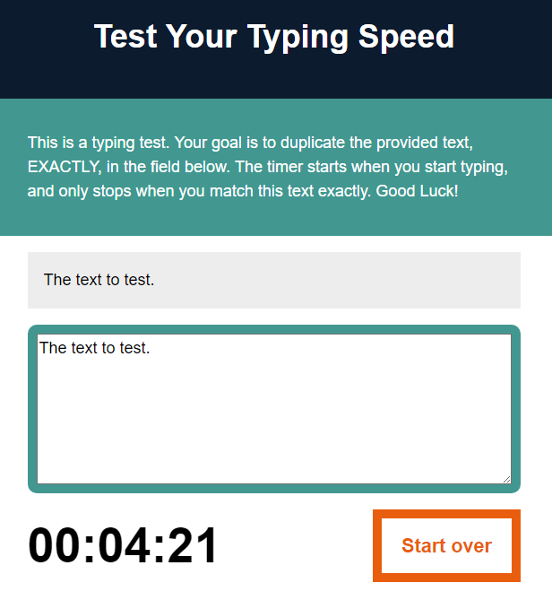

# Project: Timer
The project is centered on the design and implementation of a timer for educational purpose. 
## Table of Contents
* [General info](#general-info)
* [Screenshots](#screenshots)
* [Technologies](#technologies)
* [Status](#status)
* [Code Examples](#code-examples)
* [Features](#features)
* [Contributing](#contributing)
* [License](#license)
* [Author](#author)
## General Info
The timer project goal is to check how quickly the user will reqrite provided text.
The end result is to show the exact time used to rewrite the text.
## Screenshots

## Technologies
Project is created with:
- HTML5
- CSS3
- JS ES6
## Status
Project is: _done_
## Code Examples

```
// Start the timer:
function start() {
    let textEnteredLength = testArea.value.length;
    if (textEnteredLength === 0 && !timerRunning) {
        timerRunning = true;
        interval = setInterval(runTimer, 10);
    }
    console.log(textEnteredLength);
}

// Reset everything:
function reset() {
    clearInterval(interval);
    interval = null;
    timer = [0,0,0,0];
    timerRunning = false;
    testArea.value = "";
    theTimer.innerHTML = "00:00:00";
    testWrapper.style.borderColor = "grey";
}
```

## Features
#### List of features ready and TODOs for future development
* The timer starts when the input is provided
* The timer stops when the whole text has been rewritten
* If there is a wrong letter provided the box will light on red color
* If the text was rewritten correctly the box will light on green color
* When the user press "Start over" button the page will reset the clock and field of text

#### To-do list:
_everything is done_
## Contributing
Contributions to the project library are welcome. Please note the following guidelines before submitting your pull request:
 - Follow [JS coding](https://developer.mozilla.org/bm/docs/Web/JavaScript/Guide) standards
 - Write tests for new functions and added featues
## License
Copyright 2018 Martyna Zyskowska
## Author
Martyna Zyskowska
